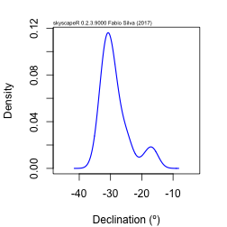
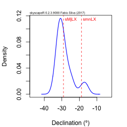
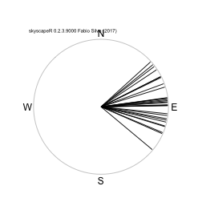
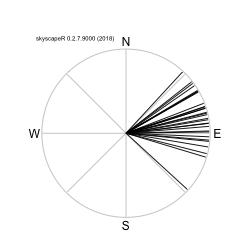
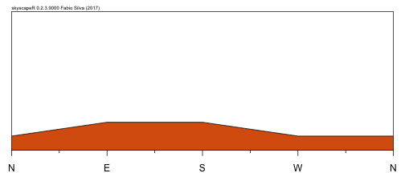
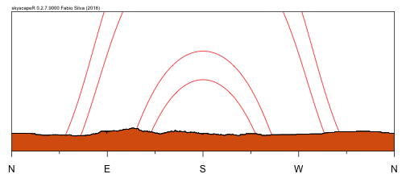
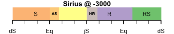
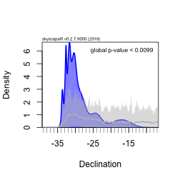

_skyscapeR_ is an open source R package for data reduction, visualization and analysis in skyscape archaeology, archaeoastronomy and cultural astronomy. It is intended to be a fully-fledged, transparent and peer-reviewed package offering a robust set of quantitative methods while retaining simplicity of use.

It includes functions to transform horizontal (Az/Alt) to equatorial (Dec/RA) coordinates, create or download horizon profiles, plot them and overlay them with visible paths of common celestial objects/events for prehistoric or historic periods, as well as functions to test statistical significance and estimate stellar visibility and seasonality. It also includes the ability to easily construct azimuth polar plots and declination curvigrams. Future versions will add more data reduction and likelihood-based model selection facilities, as well as an easy-to-use Graphical User Interface.

## 1. First Steps
Like all vignettes this is neither intended for those unexperienced in _R_ nor a fully-fledged and detailed manual for _skyscapeR_. Neither will it be understandeable to those unfamiliar with the terminology and methodologies of cultural astronomy, archaeoastronomy or skyscape archaeology.

This document is an entry-point to the package's main functions and sets out workflows of what you can do with it. More detail, as well as more functions, can be found in the package's manual pages.

If you are new to _R_ then I recommend the online free short course [Code School's TryR](http://tryr.codeschool.com). For those who are already familiar with _R_, I apologise in advance for any patronising bits (such as the next two sections). With some basic _R_ skills, guidance from this vignette and autonomous exploration of the package's manual pages, anyone with prior training in skyscape archaeology can become a master _skyscapeR_.


### Installation
The package requires that the latest version of _R_ is installed first. See the [R Project website](https://www.r-project.org/) for details. Also suggested is the installation of [RStudio](https://www.rstudio.com/). With _R_ installed, you can install the latest _skyscapeR_ release directly from [CRAN](https://cran.r-project.org/package=skyscapeR) by doing:
```
install.packages('skyscapeR')
```
This will install the package itself along with any dependencies. Upon successful completion you should see a line saying ```* DONE (skyscapeR)```. If this doesn't happen then there should be an error message explaining what went wrong.

If you rather install the latest development version (often unstable or untested) you can do so directly from the GitHub repository. Firstly, ensure you have package _devtools_ installed, by running:

```
install.packages('devtools')
```

Then type the following to download and installthe development version of  _skyscapeR_:
```
devtools::install_github('f-silva-archaeo/skyscapeR')
```
At the end, you should see the same successful completion line.


### Initialization
Every time you want to use the package it needs to be loaded. For this you need to type:

```r
library(skyscapeR)
```


### Datasets and help
The current version of _skyscapeR_ comes with a couple of datasets of measurements that can be used for learning and testing the package. These can be loaded by typing:
```
data(RugglesRSC)
```
or
```
data(RugglesCKR)
```

If you want to know more about these datasets then use the helpful ```?``` command which opens up the help page related to whatever you are asking help for.
In this case, if you want to know more about the _RugglesRSC_ dataset you can type in the console ```?RugglesRSC```. This opens the manual page for the dataset, or function. In _RStudio_ this opens on the bottom-right pane by default.


## 2. Hello, Curvigram!
Let's start by creating your first curvigram with _skyscapeR_. The function for this is aptly called ```curvigram()```. Go ahead and do ```?curvigram``` right now to learn more about it, including an example at the bottom of the manual page, which we will now do:

```r
data(RugglesRSC)
curv <- curvigram(RugglesRSC$Dec, 2)
```

This creates a curvigram based on the declination data in the _RugglesRSC_ dataset, and using an uncertainty of 2º for all measurements. You can visualize it by typing:

```r
plot(curv)
```



Be sure to check ```?curvigram``` and ```?plotCurv``` to see what other options are available.


### Adding celestial objects to a curvigram
Let's add some celestial targets to the curvigram on order to compare them with those frequency peaks. We need to create a _skyscapeR.object_ first. This is done with ```sky.objects()```:

```r
lunar <- sky.objects('moon', epoch=-2000, col='red', lty=2)
```

This creates an object that includes all standard lunar targets (currently only the lunar extremes), set for the year 1999 BCE (since there is no year zero). These will be drawn in red colour with line type (```lty```) two, which is to say as dashed lines (check out other types and options in ```?par```). Then redo the curvigram with this object:

```r
plot(curv, lunar)
```



You can now see the southern major lunar extreme (```sMjLX```) and the southern minor lunar extreme (```smnLX```) declinations for the year 1999 BCE on the same plot.


## 3. Handling and Visualizing Fieldwork Data
_skyscapeR_ has some built-in function to automatically process fieldwork data. Although the data reduction process can be done manually using other functions (such as ```az2dec()```, ```mag.dec()``` or ```sunAz()```) the entire process has been automated by using the `reduct.` functions.

### Data reduction of compass measurements
Imagine that you've just returned from a day of fieldwork surveying a set of archaeological structures for their orientation with your compass and clinometer. You can input your measurements into _R_, along with the georeferences and measurement data, and use ```reduct.compass()``` to process it:


```r
georef <- rbind( c(35.1, -7.1),     # GPS data
                 c(35.1, -7),
                 c(35.2, -7.1),
                 c(35.1, -7.3) )
azimuths <- c(93, 108, 105, 98)    # Compass measurements
altitudes <- c(2, 1.5, 0.5, 1)    # Clinometer measurements

data <- reduct.compass(loc=georef, mag.az=azimuths, date="2017/06/13", alt=altitudes)
```

```
## Altitude values found. Calculating declination...
```

```r
data
```

```
##   Latitude Longitude Magnetic.Azimuth       Date   Mag.Dec True.Azimuth
## 1     35.1      -7.1               93 2017/06/13 -1.704983       91.295
## 2     35.1      -7.0              108 2017/06/13 -1.674106      106.326
## 3     35.2      -7.1              105 2017/06/13 -1.705037      103.295
## 4     35.1      -7.3               98 2017/06/13 -1.766996       96.233
##   Altitude Declination
## 1      2.0      -0.084
## 2      1.5     -12.615
## 3      0.5     -10.818
## 4      1.0      -4.752
```
This has: (1) automatically retrieved the value of magnetic declination for your locations and date; (2) corrected azimuths to true; and (3) calculated the corresponding declination. The resulting _data.frame_ object can be easily exported into a file for safe keeping using the standard _R_ utils (such as ```write.csv()```, for example).

If the altitude component is not included then the function will only calculate the true azimuth:

```r
data <- reduct.compass(loc=georef, mag.az=azimuths, date="2017/06/13")
```

```
## No altitude values or horizon profile found. Declination values were not calculated.
```

```r
data
```

```
##   Latitude Longitude Magnetic.Azimuth       Date   Mag.Dec True.Azimuth
## 1     35.1      -7.1               93 2017/06/13 -1.704983       91.295
## 2     35.1      -7.0              108 2017/06/13 -1.674106      106.326
## 3     35.2      -7.1              105 2017/06/13 -1.705037      103.295
## 4     35.1      -7.3               98 2017/06/13 -1.766996       96.233
```

In such cases, if a horizon profile is given, the altitude can be automatically retrieved from it. See section on _Dealing with Horizons_ below for examples.

### Data reduction of theodolite measurements
On the other hand, if fieldwork consisted on theodolite/total station measurements using the sun-sight technique, the azimuths still need to be processed. For such precise measurements we recommend using function ```ten()``` to convert from deg-arcmin-arcsec to decimal point degree as follows:

```r
georef <- c( ten(35,50,37.8),     # GPS data
             ten(14,34,6.4) )
az <- c( ten(298,24,10),     # Theodolite H measurements
         ten(302,20,40) )
alt <- c( ten(1,32,10),     # Theodolite V measurements
          ten(0,2,27) )
az.sun <- ten(327,29,50)    # The azimuth of the sun as measured at time
date <- "2016/02/20"
time <- "11:07:17"    # Time the sun measurement was taken
timezone <- "Europe/Malta"    # Timezone corresponding to time above

data <- reduct.theodolite(loc=georef, az, date, time, timezone, az.sun, alt)
```

```
## Altitude values found. Calculating declination...
```

```r
data
```

```
##   Latitude Longitude Uncorrected.Azimuth           Date.Time   Sun.Az
## 1 35.84383  14.56844            298.4028 2016-02-20 11:07:17 157.7928
## 2 35.84383  14.56844            302.3444 2016-02-20 11:07:17 157.7928
##   True.Azimuth   Altitude Declination
## 1     128.6983 1.53611111   -29.64124
## 2     132.6400 0.04083333   -33.67292
```

Similarly to ```reduct.compass()``` if a horizon profile is given, the altitude can be automatically retrieved from it.

### Plotting azimuths
In general, the use of azimuths for analysis and visualization in _skyscapeR_ is deprecated since azimuths are location-specific. It is preferable to convert all measurements to declinations and work with equatorial coordinates (see section below). However _skyscapeR_ does include a much requested function to create a polar plot of azimuth values. The function is ```plotAz()```:

```r
az <- rnorm(30, 85, 20)    # This creates 30 random azimuths
plotAz(az)
```



You can use the same _skyscapeR.object_ for this plot, but then you need to specify a single location, since azimuths are location-specific. At the moment the horizon altitude is assumed to be 0º and flat as well.

```r
sunandmoon <- sky.objects(c('sun','moon'), epoch=-4000, col=c('blue','red'), lty=c(2,3))
plotAz(az, obj=sunandmoon, loc=c(52,0))
```



### Converting azimuth to declination
If you are looking for a mere horizontal to equatorial coordinate conversion, without all the extra automation that the ```reduct.``` functions provide you can use the ```az2dec()``` function:

```r
dec <- az2dec(az, loc= c(35,-7), alt=0)
dec
```

```
## numeric(0)
```


## 4. Handling Horizon Profiles
One of _skyscapeR_'s main missions is to handle horizon profile data. This is done through the creation of a _skyscapeR.hor_ object which can then be plugged in to several functions of this package not only for automation, but also for the purposes of visualizing the visible paths of celestial objects.

### Creating or downloading profiles
If you have azimuth and altitude data a profile can be constructed as in the following example:

```r
az <- c(0,90,180,270,360)
alt <- c(0,5,5,0,0)
georef = c(40.1, -8)
hor <- createHor(az, alt, loc=georef, name= 'Horizon Profile 1')
```

This can be visualized by simply typing:

```r
plot(hor)
```



Not the prettiest horizon you've ever seen, but that's what can be interpolated from the five datapoints given...

A prettier horizon profile can be downlaoded from the [HeyWhatsThat (HWT)](http://www.heywhatsthat.com) website. These profiles are based on the SRTM digital elevation models and, therefore are not always trustworthy (especially so if the horizon is near). Nevertheless they can be a great help for situations when a horizon altitude is impossible to measure on site. To do this, first create a horizon profile at the HWT website, then save the 8-digit ID code that is as the end of the permanent link given by HWT. For example, if the link is `https://www.heywhatsthat.com/?view=NML6GMSX`, save the bit after `view=` and use function ```download.HWT()```:


```r
hor <- download.HWT('NML6GMSX')
plot(hor)
```


### Exporting profiles to _Stellarium_
One can then export these profiles into a format that _Stellarium_ recognises:
```
exportHor(hor, name='Test', description='Test horizon export to Stellarium')
```
This creates a zip-file ready to be imported into _Stellarium_'s landscape feature.

### Automating horizon altitude retrieval
With a horizon profile set up (or even many), you can retrieve the horizon altitude for any azimuth value by doing:

```r
hor2alt(hor, az=90)
```

```
## [1] 2.06
```

```r
hor2alt(hor, az=110)
```

```
## [1] 2.91
```

This automation can also be used in the data reduction functions by using a _skyscapeR.horizon_ object rather than simple georeferences:

```r
data <- reduct.compass(loc=hor, mag.az=azimuths, date="2017/06/13")
```

```
## Horizon profile found. Obtaining altitude values and calculating declination...
```

```r
data
```

```
##   Latitude Longitude Magnetic.Azimuth       Date   Mag.Dec True.Azimuth
## 1 40.44385 -7.938178               93 2017/06/13 -2.118487       90.882
## 2 40.44385 -7.938178              108 2017/06/13 -2.118487      105.882
## 3 40.44385 -7.938178              105 2017/06/13 -2.118487      102.882
## 4 40.44385 -7.938178               98 2017/06/13 -2.118487       95.882
##   Altitude Declination
## 1     2.06       0.471
## 2     2.74     -10.366
## 3     2.50      -8.296
## 4     2.22      -3.215
```

### Visualizing celestial object paths 
```plot()``` can be used to display the visible paths of celestial objects chosen with ```sky.objects()```. To use the one we created before for the curvigram just type:

```r
plot(hor, obj=lunar)
```


Or create a new one, in this case using an epoch range for cases where we might have uncertainty in the age of the site, and including both solar and a stellar target:

```r
aux <- sky.objects(names=c('sun', 'Aldebaran'), epoch=c(-4300,-3700), col=c('blue', 'red'))
plot(hor, obj=aux)
```




## 5. Stars
_skyscapeR_ includes data on the brightest 100 stars in the night sky. The data table is accessible via ```data(stars)```. To pick a particular star, maybe to see what declination it has, or had, you can do as follows:

```r
ss <- star('Sirius')
ss
```

```
## $name
## [1] "Sirius"
## 
## $constellation
## [1] "Cma"
## 
## $colour
## [1] "White"
## 
## $app.mag
## [1] -1.46
## 
## $ra
## [1] 101.2885
## 
## $dec
## [1] -16.71314
## 
## $proper.motion
## [1]  -546.01 -1223.08
## 
## $epoch
## [1] "J2000.0"
## 
## attr(,"class")
## [1] "skyscapeR.star"
```

This shows the information for Sirius which is now loaded into object `ss`. Note the epoch the data is output, _J2000_, by default. To get coordinates for other epochs just do:

```r
ss <- star('Sirius', year=-4000)
ss$dec
```

```
## [1] -26.57285
```


### Star phases and seasonality
To estimate the phases, events and/or seasonality of stars, the function ```star.phases()``` can be used. It works as follows, for the location of Cairo, an epoch of -3000, and a horizon altitude of 2º:

```r
# ncores forced to 2 for production of this document
sp <- star.phases('Sirius', -3000, loc=c(30.0,31.2), alt.hor=2, ncores=2)  
```

```
## Running calculations on 2 processing cores. This may take a while...
```

One can then check the star's phase, event date-range and seasons by typing:

```r
sp$phase
```

```
## [1] "Arising and Lying Hidden"
```

```r
sp$events
```

```
##                    [,1]                
## Achronycal Setting "April 2 - April 24"
## Heliacal Rising    "July 2 - July 27"
```

```r
sp$seasons
```

```
##                          [,1]                      
## Rising                   "July 2 - October 21"     
## Rising and Setting       "October 20 - December 31"
## Setting                  "January 1 - April 24"    
## Arising and Lying Hidden "April 25 - July 1"
```

The time period for events is a range of dates where, given the parameters, it is possible to observe the star and recognise the observation as the said event (note in particular the meaning of parameter `alt.rs` in the manual page for ```star.phases()```). These can be visualized using:

```r
plot(sp)
```




## Significance Testing for Curvigrams
You can test the statistical significance of an empirical curvigram by comparing it with the expectattion of a given null hypothesis. This technique can be used to output a _p-value_ (either 1-tailed or 2-tailed) which is an established measure of significance. 

_skyscapeR_ comes with a limited set of built-in null hypothesis, namely that of a random azimuthal orientation (`distRandom()`), a random solar orientation (`distSolarRange()`), a random lunar orientation (`distLunarRange()`), a random orientation to the Summer Full Moon (`distSummerFM()`) and a random orientation to one of the brightest stars (`distStars()`). To demonstrate significance testing we will again use the Recumbent Stone Circle data. But first, one needs to choose one's null hypothesis. As usual, the help pages are essential to understand what parameters are required:

```r
nullhyp <- distRandom(c(57,2), alt=0)
```

Then one uses `sigTest()` to run the significance testing routine. This can take a while depending on your machine's resources. If it takes too long, try lowering the _nsims_ parameter (though this brings a cost of resolution, see the manual page for this function).

```r
# ncores forced to 2 for production of this document
sg <- sigTest(curv, nullhyp, ncores=2)   
```

```
## Running calculations on 2 processing cores. This may take a while...
```

```
## Performing a 1-tailed test at the 95% significance level.
```

One can then plot the curvigram again, but now with the results of the significance testing displayed. This adds the expectation around the null hypothesis (the grey shaded area) as well as the estimated global p-value.

```r
plot(curv,signif=sg)
```



If one is not interested in ploting the results of the significance testing, but simply getting the values then you can retrieve them from the output of `sigTest()`:

```r
sg$p.value
```

```
## [1] 0.0004997501
```

```r
sg$maxima
```

```
##             [,1]       [,2]
## dec    -30.03987 -17.039112
## zScore  10.62414   1.071345
```
